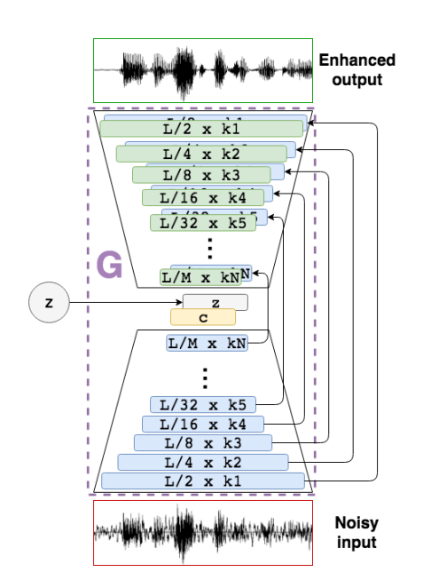

# SEGAN Implementation in TensorFlow 2

## Introduction
This repository is an implementation of Speech Enhancement Generative Adversarial Network (SEGAN) using TensorFlow 2.X

- Original SEGAN paper (https://arxiv.org/abs/1703.09452) published by Pascual et al. in 2017. 
- Original TensorFlow 1.x based implementation can be found from here (https://github.com/santi-pdp/segan). 
<br />
This model leverages the power of Generative Adversarial Networks (GANs) to tackle the challenge of removing unwanted noise from speech signals, and has the key features:

- End-to-End Learning: Unlike traditional methods that operate on specific aspects of the signal, SEGAN works directly on the raw audio waveform. This allows the model to capture the complex relationships between the speech and noise components.
- Generative Adversarial Network: SEGAN employs a GAN architecture. This involves two competing neural networks:
  * Generator: This network aims to create noise-free speech by learning from noisy examples.
  * Discriminator: This network acts as a critic, attempting to distinguish between the real clean speech and the generated speech produced by the generator.




## Dependencies
* Python 3.9
* TensorFlow 2.x

You can install the required packages via pip:
```
pip install -r requirements.txt
```
## Instructions

### Data preparation 
Prepare the traning/validation/test datasets based on noisy and clean dataset.  
```
Dataset_preparation.py
```
